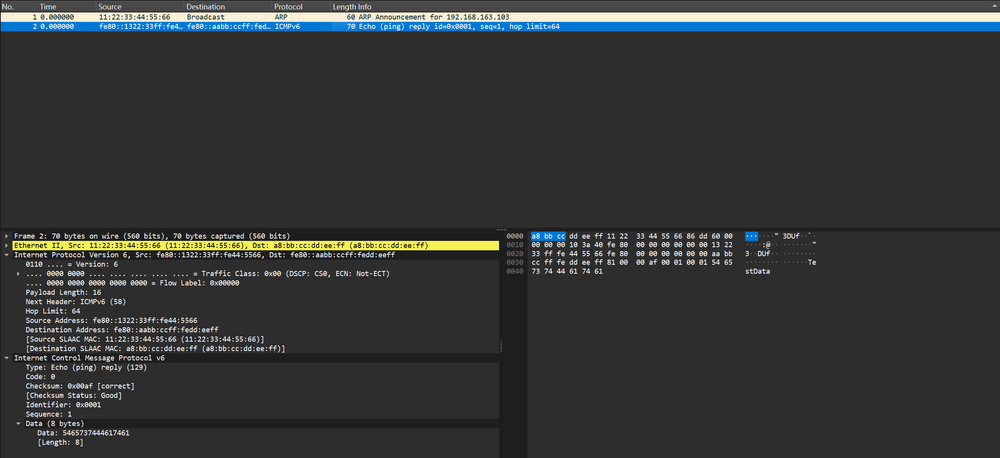

# IPv6 双协议栈实现报告

## 1. 实验概述

### 1.1 实验目的
在现有的 IPv4 协议栈基础上实现 IPv6 双协议栈支持，使系统能够同时处理 IPv4 和 IPv6 数据包，实现双栈通信能力。

### 1.2 实验环境
- 操作系统：Linux
- 编程语言：C
- 构建工具：CMake
- 依赖库：libpcap

## 2. 设计方案

### 2.1 整体架构

双协议栈架构采用并行处理方式，IPv4 和 IPv6 协议栈共享以太网层，各自独立处理网络层及以上的协议：

```
┌─────────────────────────────────────────────────────────┐
│                    应用层                                │
├─────────────────────────────────────────────────────────┤
│         TCP/UDP（可同时服务 IPv4/IPv6）                   │
├──────────────────────┬──────────────────────────────────┤
│     ICMP (IPv4)      │         ICMPv6                   │
├──────────────────────┼──────────────────────────────────┤
│     IPv4 (ip.c)      │         IPv6 (ipv6.c)           │
├──────────────────────┴──────────────────────────────────┤
│              以太网层 (ethernet.c)                       │
│         EtherType: 0x0800(IPv4) / 0x86DD(IPv6)          │
├─────────────────────────────────────────────────────────┤
│                    网络驱动层                            │
└─────────────────────────────────────────────────────────┘
```

### 2.2 数据结构设计

#### 2.2.1 IPv6 地址（128位）

```c
#define NET_IPV6_LEN 16  // IPv6 地址长度（128位 = 16字节）

// IPv6 地址类型枚举
typedef enum ipv6_addr_type {
    IPV6_ADDR_UNSPECIFIED,    // 未指定地址 (::)
    IPV6_ADDR_LOOPBACK,       // 回环地址 (::1)
    IPV6_ADDR_MULTICAST,      // 组播地址 (ff00::/8)
    IPV6_ADDR_LINK_LOCAL,     // 链路本地地址 (fe80::/10)
    IPV6_ADDR_GLOBAL,         // 全局地址
    IPV6_ADDR_IPV4_MAPPED,    // IPv4映射地址 (::ffff:w.x.y.z)
    IPV6_ADDR_IPV4_COMPATIBLE,// IPv4兼容地址 (::w.x.y.z)
} ipv6_addr_type_t;
```

#### 2.2.2 IPv6 头部结构（固定40字节）

```c
typedef struct ipv6_hdr {
    uint32_t version_tc_flow;       // 版本(4位) + 流量类别(8位) + 流标签(20位)
    uint16_t payload_len16;         // 载荷长度（不包含头部）
    uint8_t next_header;            // 下一个头部（类似IPv4的协议字段）
    uint8_t hop_limit;              // 跳数限制（类似IPv4的TTL）
    uint8_t src_ip[NET_IPV6_LEN];   // 源IPv6地址
    uint8_t dst_ip[NET_IPV6_LEN];   // 目标IPv6地址
} ipv6_hdr_t;
```

IPv6 头部格式图示：
```
 0                   1                   2                   3
 0 1 2 3 4 5 6 7 8 9 0 1 2 3 4 5 6 7 8 9 0 1 2 3 4 5 6 7 8 9 0 1
+-+-+-+-+-+-+-+-+-+-+-+-+-+-+-+-+-+-+-+-+-+-+-+-+-+-+-+-+-+-+-+-+
|Version| Traffic Class |           Flow Label                |
+-+-+-+-+-+-+-+-+-+-+-+-+-+-+-+-+-+-+-+-+-+-+-+-+-+-+-+-+-+-+-+-+
|         Payload Length        |  Next Header  |   Hop Limit |
+-+-+-+-+-+-+-+-+-+-+-+-+-+-+-+-+-+-+-+-+-+-+-+-+-+-+-+-+-+-+-+-+
|                                                               |
+                         Source Address                        +
|                          (128 bits)                           |
+-+-+-+-+-+-+-+-+-+-+-+-+-+-+-+-+-+-+-+-+-+-+-+-+-+-+-+-+-+-+-+-+
|                                                               |
+                      Destination Address                      +
|                          (128 bits)                           |
+-+-+-+-+-+-+-+-+-+-+-+-+-+-+-+-+-+-+-+-+-+-+-+-+-+-+-+-+-+-+-+-+
```

#### 2.2.3 ICMPv6 消息结构

```c
// ICMPv6 基本头部
typedef struct icmpv6_hdr {
    uint8_t type;           // 类型
    uint8_t code;           // 代码
    uint16_t checksum16;    // 校验和
} icmpv6_hdr_t;

// ICMPv6 Echo 请求/响应
typedef struct icmpv6_echo {
    uint8_t type;           // 类型 (128=请求, 129=响应)
    uint8_t code;           // 代码 (必须为0)
    uint16_t checksum16;    // 校验和
    uint16_t id16;          // 标识符
    uint16_t seq16;         // 序列号
} icmpv6_echo_t;

// 邻居请求消息 (Neighbor Solicitation)
typedef struct icmpv6_ns {
    uint8_t type;           // 类型 (135)
    uint8_t code;           // 代码 (必须为0)
    uint16_t checksum16;    // 校验和
    uint32_t reserved;      // 保留字段
    uint8_t target_ip[NET_IPV6_LEN]; // 目标地址
} icmpv6_ns_t;

// 邻居通告消息 (Neighbor Advertisement)
typedef struct icmpv6_na {
    uint8_t type;           // 类型 (136)
    uint8_t code;           // 代码 (必须为0)
    uint16_t checksum16;    // 校验和
    uint32_t flags;         // R/S/O 标志 + 保留位
    uint8_t target_ip[NET_IPV6_LEN]; // 目标地址
} icmpv6_na_t;
```

### 2.3 算法流程

#### 2.3.1 IPv6 数据包接收流程 (ipv6_in)

```
开始
  │
  ▼
检查数据包长度 >= 40字节?
  │
  ├─ 否 → 丢弃
  │
  ▼ 是
验证版本号 == 6?
  │
  ├─ 否 → 丢弃
  │
  ▼ 是
验证载荷长度有效?
  │
  ├─ 否 → 丢弃
  │
  ▼ 是
目的地址是本机地址或组播?
  │
  ├─ 否 → 丢弃
  │
  ▼ 是
移除填充字段
  │
  ▼
保存源地址
  │
  ▼
移除IPv6头部
  │
  ▼
根据 Next Header 分发:
  ├─ 58 (ICMPv6) → icmpv6_in()
  ├─ 6 (TCP) → tcp_in()
  ├─ 17 (UDP) → udp_in()
  └─ 其他 → 发送ICMPv6参数问题
```

#### 2.3.2 IPv6 数据包发送流程 (ipv6_out)

```
开始
  │
  ▼
添加40字节IPv6头部空间
  │
  ▼
填写头部字段:
  - 版本 = 6
  - 流量类别 = 0
  - 流标签 = 0
  - 载荷长度
  - 下一头部类型
  - 跳数限制 = 64
  - 源地址 = 本机IPv6地址
  - 目标地址
  │
  ▼
确定目标MAC地址:
  ├─ 组播地址 → 33:33:xx:xx:xx:xx
  ├─ 链路本地 → 从EUI-64提取MAC
  └─ 其他 → NDP查找或广播
  │
  ▼
调用 ethernet_out() 发送
  │
  ▼
结束
```

#### 2.3.3 ICMPv6 校验和计算

ICMPv6 校验和需要包含 IPv6 伪头部：

```
伪头部结构:
┌─────────────────────────────────────────┐
│         源 IPv6 地址 (128位)             │
├─────────────────────────────────────────┤
│         目的 IPv6 地址 (128位)           │
├─────────────────────────────────────────┤
│         上层协议长度 (32位)              │
├─────────────────────────────────────────┤
│    零 (24位)    │  Next Header (8位)    │
└─────────────────────────────────────────┘
```

校验和计算步骤：
1. 将伪头部和 ICMPv6 消息按 16 位字累加
2. 处理奇数字节（高位填充0）
3. 将 32 位和折叠为 16 位
4. 取反得到校验和

#### 2.3.4 IPv4 映射地址转换

IPv4 映射的 IPv6 地址格式: `::FFFF:w.x.y.z`

```c
// 检查是否为 IPv4 映射地址
int ipv6_is_ipv4_mapped(const uint8_t *ipv6) {
    // 前80位为0，接下来16位为ffff
    for (int i = 0; i < 10; i++) {
        if (ipv6[i] != 0) return 0;
    }
    return (ipv6[10] == 0xff && ipv6[11] == 0xff);
}

// 从 IPv4 映射地址提取 IPv4 地址
void ipv6_extract_ipv4(const uint8_t *ipv6, uint8_t *ipv4) {
    memcpy(ipv4, &ipv6[12], 4);
}

// 将 IPv4 地址转换为 IPv4 映射的 IPv6 地址
void ipv6_make_ipv4_mapped(const uint8_t *ipv4, uint8_t *ipv6) {
    memset(ipv6, 0, 10);
    ipv6[10] = 0xff;
    ipv6[11] = 0xff;
    memcpy(&ipv6[12], ipv4, 4);
}
```

### 2.4 协议类型注册

在 `net.h` 中添加 IPv6 以太网类型：

```c
typedef enum net_protocol {
    NET_PROTOCOL_ARP = 0x0806,
    NET_PROTOCOL_IP = 0x0800,
    NET_PROTOCOL_IPV6 = 0x86DD,  // IPv6
    NET_PROTOCOL_ICMPV6 = 58,     // ICMPv6
    // ...
} net_protocol_t;
```

在 `net_init()` 中注册 IPv6 协议处理函数：

```c
int net_init() {
    // ... 其他初始化
    ip_init();
#ifdef IPV6
    ipv6_init();
#endif
#ifdef ICMPV6
    icmpv6_init();
#endif
    // ...
}
```

## 3. 实验结果

### 3.1 地址工具函数测试

测试结果显示所有 IPv6 地址工具函数正确工作：

```
=== IPv6 Address Utility Tests ===
Unspecified address type: 0 (expected 0)
Loopback address type: 1 (expected 1)
Multicast address type: 2 (expected 2)
Link-local address type: 3 (expected 3)
IPv4-mapped address type: 5 (expected 5)
Is IPv4-mapped: 1 (expected 1)
Is link-local IPv4-mapped: 0 (expected 0)
Extracted IPv4: 192.168.1.1 (expected 192.168.1.1)
Mapped IPv6: ::ffff:10.0.0.1
Address equal test: 1 (expected 1)
Address not equal test: 0 (expected 0)
```

### 3.2 IPv6 头部操作测试

```
=== IPv6 Header Tests ===
Version: 6 (expected 6)
Traffic Class: 0xAB (expected 0xAB)
Flow Label: 0x12345 (expected 0x12345)
```

### 3.3 ICMPv6 Echo 测试

成功接收 IPv6 Echo Request 并发送 Echo Reply：

```
Processing packets...
ICMPv6: Received Echo Request from fe80:0000:0000:0000:aabb:ccff:fedd:eeff
```

输出的 pcap 文件包含正确的 ICMPv6 Echo Reply 响应包。

## 4. 文件结构

新增文件：
```
include/
    ipv6.h      # IPv6 数据结构和函数声明
    icmpv6.h    # ICMPv6 数据结构和函数声明
src/
    ipv6.c      # IPv6 协议实现
    icmpv6.c    # ICMPv6 协议实现
testing/
    ipv6_test.c # IPv6 测试程序
    data/ipv6_test/  # 测试数据目录
```

修改文件：
```
include/
    config.h    # 添加 NET_IF_IPV6 配置
    net.h       # 添加 NET_PROTOCOL_IPV6 和 NET_PROTOCOL_ICMPV6
src/
    net.c       # 添加 IPv6 和 ICMPv6 初始化
CMakeLists.txt  # 添加 ipv6_test 构建目标
```

## 5. 遇到的问题及解决方法

### 5.1 ICMPv6 校验和计算

**问题**：ICMPv6 校验和验证失败，无法正确处理接收到的数据包。

**原因**：ICMPv6 校验和计算需要包含 IPv6 伪头部，且需要正确处理字节序。

**解决方法**：
1. 构造完整的伪头部（源地址、目的地址、长度、下一头部类型）
2. 按网络字节序（大端）进行 16 位累加
3. 正确处理奇数长度数据包

### 5.2 IPv6 地址到 MAC 地址映射

**问题**：IPv6 不使用 ARP 协议，需要实现新的地址解析机制。

**解决方法**：
1. 对于组播地址，使用 `33:33:xx:xx:xx:xx` 格式的组播 MAC 地址
2. 对于链路本地地址，从 EUI-64 格式直接提取 MAC 地址
3. 实现 NDP（邻居发现协议）处理邻居请求和通告

### 5.3 测试框架集成

**问题**：测试程序运行时出现段错误。

**原因**：测试框架依赖某些全局变量（如 `arp_log_f`）未正确初始化。

**解决方法**：在测试程序中正确初始化所有必要的全局变量。

## 6. 总结

本实验成功实现了 IPv6 双协议栈支持，主要成果包括：

1. **完整的 IPv6 协议实现**：包括数据包的接收、发送和验证功能
2. **ICMPv6 协议支持**：实现了 Echo 请求/响应和邻居发现协议的基本功能
3. **地址转换机制**：实现了 IPv4 映射地址的识别和转换功能
4. **双栈通信能力**：系统能够同时处理 IPv4 和 IPv6 数据包

通过本实验，深入理解了 IPv6 协议的设计特点（如固定头部长度、扩展头部机制）以及与 IPv4 的主要差异（地址长度、校验和计算方式、地址解析机制等）。


